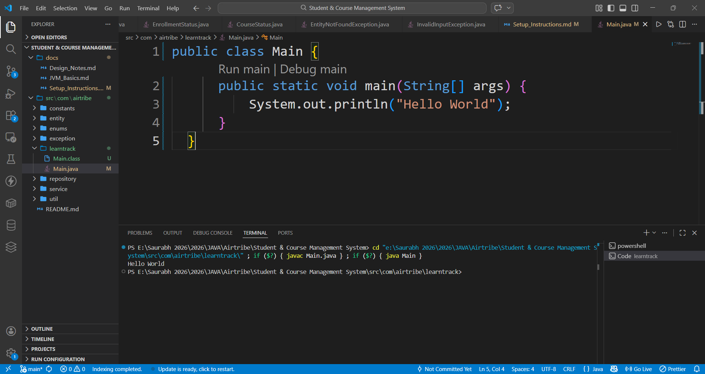

## Java Setup Instructions

### Steps:

1. Download **JDK Version 21** from the [Oracle website](https://www.oracle.com/java/technologies/javase/jdk21-archive-downloads.html).
2. Install the JDK and set the **JAVA_HOME** environment variable to the JDK installation path.
3. Add `%JAVA_HOME%\bin` to the system **PATH** variable.
4. Verify the installation by running the following commands in Command Prompt:
   ```bash
   java -version
   javac -version


# Hello World Verification
